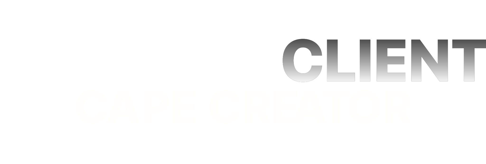

  

<h1 align="center">🎮 NRC Cape Creator</h1>

  <strong>Create custom Minecraft capes with gradients, emojis, text, templates, and a live 3D preview.</strong>

  <a href="#-features">Features</a> •
  <a href="#-getting-started">Getting Started</a> •
  <a href="#-usage">Usage</a>

---

## 🖥️ Demo  
**🔗 Live Demo:** [NRC Cape Creator](https://einp2pe.github.io/NRC-Cape-Creator/)

---

### Fonts Included
- System: Sans-serif, Serif, Monospace, Impact, Comic Sans
- Bold & Impact: Anton, Bebas Neue, Black Ops One, Bungee, Russo One, Oswald, Titan One, Ultra
- Gaming & Tech: Orbitron, Press Start 2P, VT323, Bangers, Silkscreen
- Fun & Display: Creepster, Nosifer, Monoton, Righteous, Concert One
- Handwritten: Lobster, Pacifico, Dancing Script, Caveat, Indie Flower
- Elegant: Playfair Display, Cinzel, Abril Fatface, Fredoka

## ✨ Features

### 🎨 Gradient Designer
- Multi-color gradients — add and reorder colors freely

- Preset gradients for quick starts (Sunset, Pastel, Purple, Green, Fire, Ocean, Dark, Light)
- Direction control — vertical or horizontal gradient flow
- Live 2D canvas preview updates instantly

### 🖼️ Image Upload & Cropping
- Three image zones: front cape, back cape, and elytra wings

### 🧭 Templates & Presets
- Built-in template gallery grouped by category (Pride, Summer, Winter, Gaming, Minecraft, Gradients, Fun)
- Templates apply gradient and overlay defaults; can be applied to main, elytra, or both

### 🧩 3D Preview & Skin Viewer
- Live 3D preview powered by skinview3d (Three.js) that syncs with the 2D canvas
- Load Minecraft skins by username or upload a skin file
- Toggle elytra rendering in the 3D viewer

### 📱 Responsive Design
- Desktop, tablet and mobile-friendly layouts
- Touch-friendly cropper and controls
- iOS safe-area aware

---

## 📖 Usage

### Creating a Cape

1. Choose or create a gradient
2. Upload images for front/back/elytra and crop if needed
3. Change Color, Gradients or add of the many Templates
3. Download the resulting cape texture as PNG

### Canvas / Cape Layout

| Region | Size | Position |
|--------|------|----------|
| Gradient Area | 368×176px | Top-left |
| Front Image | 80×128px | (8, 8) |
| Back Image | 80×128px | (96, 8) |
| Elytra | 80×160px | (288, 16) |
| **Total Canvas** | **512×256px** | – |

---
